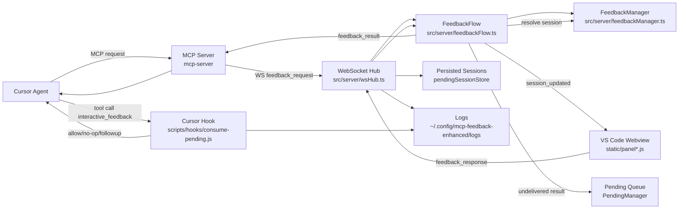
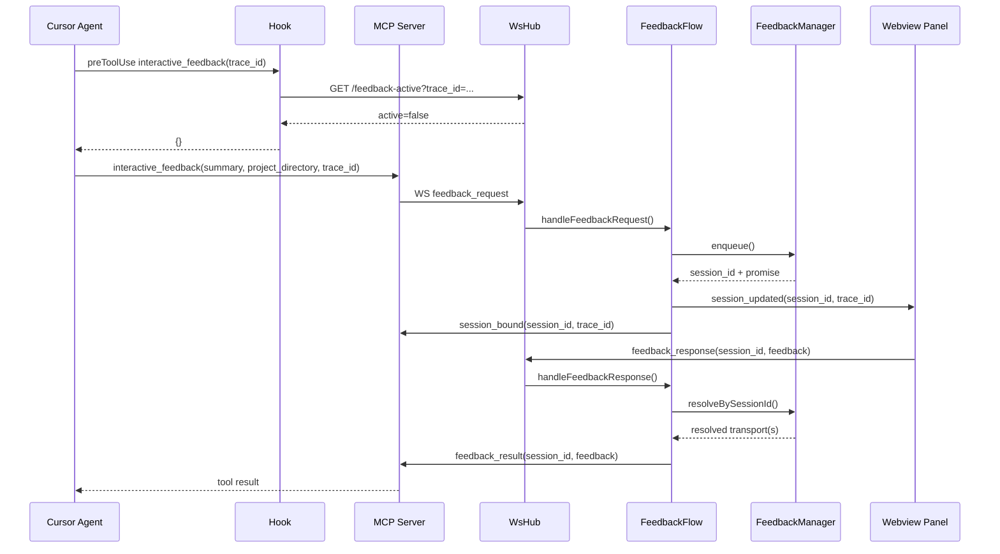
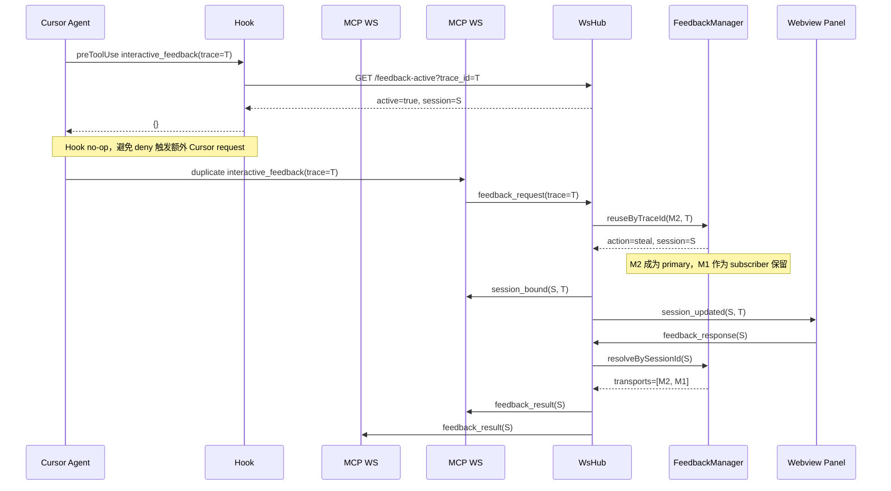
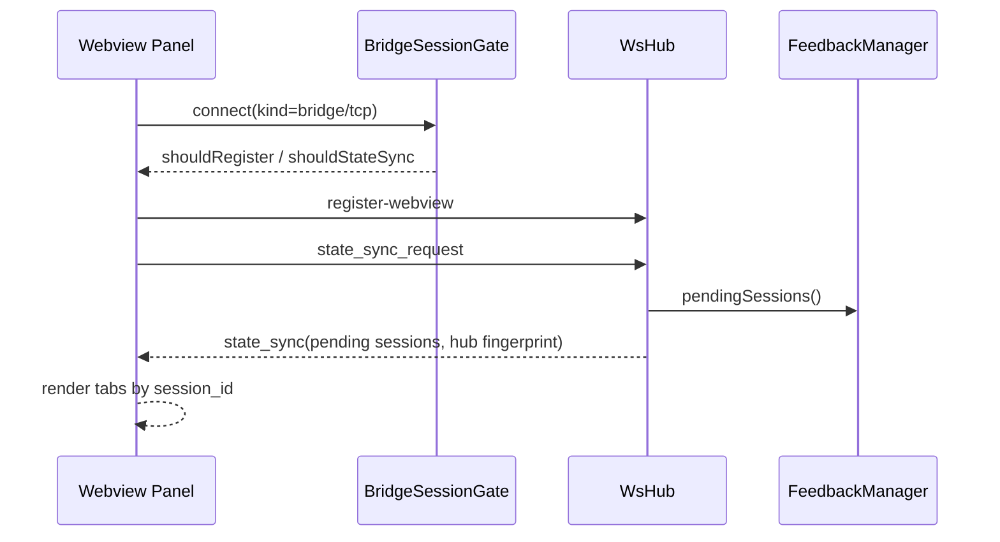
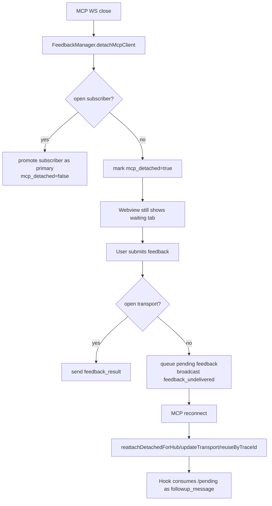
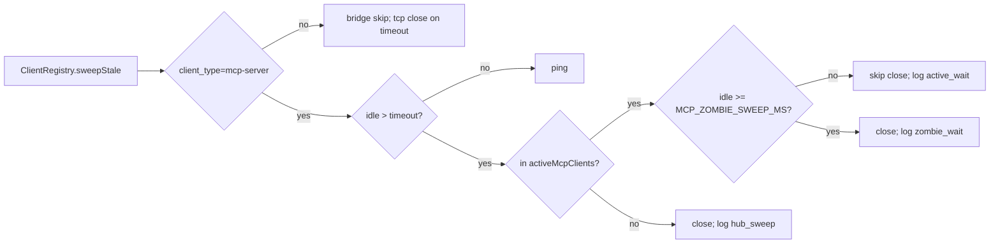

# MCP Feedback 数据链路与稳定性改造说明

本文档描述当前前端、Hook、MCP Server、Hub、Webview 之间的数据链路，以及为了避免额外 Cursor request、状态不一致和竞态执行需要保持的设计不变量。

## 目标

- 一个 Cursor trace 只对应一个活跃 feedback session。
- 重复的 `interactive_feedback` 调用不能提前完成旧 MCP wait。
- Hook 只能做 no-op 或 `followup_message` 提醒，不能用 `permission: deny` 伪造反馈结果。
- 用户提交反馈后，Hub 只向仍然打开的 MCP transport 发送 `feedback_result`。
- MCP transport 掉线时 session 保留，Webview 仍可显示和提交，结果进入 pending 队列等待后续交付。

## 组件关系图



## 正常请求时序



关键点：

- `session_bound` 只绑定当前 MCP wait 与 Hub session，不代表用户已经回复。
- `feedback_result` 只能由 `feedback_response` 触发。
- `pending_persist` 在 enqueue、partial resolve、all resolved 时更新磁盘状态，用于 Hub 重启恢复。

## 同 Trace 重复请求链路



不变量：

- live same-trace steal 不发送 `released_duplicate`。
- 旧 MCP transport 不被提前完成，而是作为 subscriber 等待同一个用户提交结果。
- 如果新 primary 断开，`detachMcpClient()` 会提升打开的 subscriber，session 不进入 detached。
- `activeMcpClients()` 必须包含 primary 和 subscriber，避免 heartbeat stale sweep 误关活跃 wait。

## Hook 决策流

```mermaid
flowchart TD
    Start[preToolUse] --> IsFeedback{interactive_feedback?}
    IsFeedback -- yes --> Active[GET /feedback-active?trace_id]
    Active --> ActiveWait{live wait active?}
    ActiveWait -- yes --> Noop[return {}<br/>log action=skip_duplicate_active_wait]
    ActiveWait -- no --> Allow[allow tool<br/>return {}]
    IsFeedback -- no --> Server{server found?}
    Server -- yes --> Pending[GET /pending?consume=1]
    Pending --> HasPending{pending comments/images?}
    HasPending -- yes --> FollowPending[followup_message<br/>deliver pending]
    HasPending -- no --> Enforce[check rules refresh]
    Server -- no --> Enforce
    Enforce --> NeedRefresh{count/time threshold?}
    NeedRefresh -- yes --> FollowRefresh[followup_message<br/>ask to call feedback]
    NeedRefresh -- no --> Empty[return {}]
```

Hook 输出约束：

| 场景 | 输出 | 原因 |
| --- | --- | --- |
| 同 trace 已有 live wait，又调用 `interactive_feedback` | `permission: deny` | 阻断重复 MCP tool call，并要求 Agent 等现有面板回复 |
| 有 pending 用户反馈需要交给 Agent | `followup_message` | 注入消息，不完成 MCP wait |
| 长任务规则刷新 | `followup_message` | 提醒调用 feedback，不阻断当前工具 |
| stop hook | `{}` | 避免 stop followup 循环 |

## Webview 状态同步链路



约束：

- bridge/tcp 重连可以触发 state sync，但不应重复注册同一 bridge session。
- fallback `BridgeSessionGate` 需要和正式实现保持相同行为：首次注册，重复连接只打标签，重连只同步状态。
- Webview 以 `session_id` 为提交目标，避免多 tab 时误投递到第一个 pending。

## 断连与恢复链路



恢复约束：

- MCP register 阶段没有 request trace，只能在唯一 detached candidate 时自动 reattach。
- 如果同一 workspace 有多个 detached session，register 阶段必须保持 detached，等待后续 `feedback_request.trace_id` 精确匹配。
- `feedback_request` 处理顺序必须是 trace 精确复用优先，project transport fallback 次之。否则 trace=T2 的请求可能被同项目第一个 dead session 错绑。

## Heartbeat 与 Zombie Wait



设计意图：

- 普通 idle MCP 可以被关闭。
- 有 live pending feedback 的 MCP transport 被保护，避免用户正在回复时 Cursor 链接被扫掉。
- 超过 zombie 阈值的活跃 wait 仍会关闭，避免永久泄漏。

## 日志与排查入口

日志目录：`~/.config/mcp-feedback-enhanced/logs/`

| 文件 | 主要内容 | 关键事件 |
| --- | --- | --- |
| `hooks-YYYY-MM-DD.log` | Cursor Hook 决策 | `action=skip_duplicate_active_wait`, `rules refresh followup`, `delivering pending via followup_message` |
| `mcp-server-YYYY-MM-DD.log` | MCP Server 与 Hub 通信 | MCP request/result、连接状态 |
| `extension-YYYY-MM-DD.log` | VS Code extension/Hub | `feedbackRequest`, `feedbackDeliver`, `stale_sweep`, `pending_persist` |
| `webview-YYYY-MM-DD.log` | Panel 端状态 | bridge/tcp 连接、submit、state sync |
| session journal | session 生命周期 | `create`, `transport_reuse`, `trace_reuse`, `trace_steal`, `resolve` |

推荐 grep：

```bash
rg "skip_duplicate_active_wait|trace steal|feedbackDeliver|released_duplicate|request_waste_guard|request_billing_risk" ~/.config/mcp-feedback-enhanced/logs
rg "permission.: deny|rules refresh followup|delivering pending via followup_message" ~/.config/mcp-feedback-enhanced/logs/hooks-*.log
rg "stale_sweep|zombie_wait|active_wait|mcp_reattach_detached" ~/.config/mcp-feedback-enhanced/logs/extension-*.log
```

健康信号：

- 同 trace 重复调用只看到 `skip_duplicate_active_wait` 或 `trace steal subscribed prior mcp`。
- 不再出现新生成的 `released_duplicate`。
- 不再出现 Hook 对 feedback/rules refresh 输出 `permission: deny`。
- 用户提交后看到 `feedbackDeliver: session=... transports=N`，其中 `N` 可以是 1 或 2。
- `event=panel_submit_delivered` / `event=panel_submit_no_effect` 应保留同一个 `trace=...`，不能因为 session 已 resolve 而退化成 `trace=-`。

## Resolve 快照

`FeedbackManager.resolveFirst()` 和 `resolveBySessionId()` 会从 pending queue 删除 session。凡是删除后仍需要写日志、通知 Webview 或投递给 MCP 的字段，必须在 resolve payload 上携带快照：

```mermaid
flowchart LR
    Entry[PendingFeedback entry] --> Resolve[resolveBySessionId / resolveFirst]
    Resolve --> Snapshot[ResolvedFeedback snapshot<br/>transport(s), projectDir, traceId, enqueuedAt, mcpDetached]
    Snapshot --> Deliver[FeedbackFlow promise handler]
    Deliver --> Logs[delivered/no-effect logs preserve trace + wait_ms]
    Deliver --> MCP[feedback_result to open transports]
```

禁止在 resolve 后只依赖 `waitMetaForSession(session_id)` 回查上下文，因为此时队列里已经没有该 session。

## 数据所有权

| 数据 | Owner | 读写方 | 约束 |
| --- | --- | --- | --- |
| pending session queue | `FeedbackManager` | `FeedbackFlow`, `WsHub` | 只有 Manager 修改队列和 transport 关系 |
| WebSocket 客户端集合 | `ClientRegistry` | `WsHub` | stale sweep 只能通过 `activeMcpClients()` 判断活跃 MCP wait |
| Webview tab state | Webview panel | Hub state sync | 以 `session_id` 为主键 |
| pending feedback comments/images | `PendingManager` | Hook `/pending`, FeedbackFlow | 只用于 MCP 链接丢失后的后续交付 |
| trace/workspace context | Hook + `traceContext` | Hook, Hub | trace 优先，project 只用于 workspace 匹配和 reconnect |
| session journal/logs | Hub/Hook | 排查工具 | 所有关键信号必须带 session/trace/project 中至少两个维度 |

## 稳定性改造建议

短期低风险：

- 保持当前 KISS 边界：Hook 不完成请求，Hub 不创建多余 session，Manager 统一管理 transport。
- 每次改 `feedback-active`、`reuseByTraceId`、`detachMcpClient`、`sweepStale`，先补 race 回归测试。
- 给同 trace 路径保留三类断言：no deny、no released_duplicate、fan-out to all open transports。
- 继续使用 `followup_message` 传递提示和 pending，不再把 Hook deny 当作控制流。
- 所有日志新增字段优先用稳定 key/value：`event=`, `session=`, `trace=`, `action=`, `reason=`, `transport=`, `readyState=`。

中期改造：

- 将 feedback session 抽成显式状态机：`created -> bound -> waiting -> resolving -> resolved | detached | queued_pending`。
- 为状态机加 property/model tests，随机生成 connect/disconnect/duplicate/submit 顺序，验证不会多 resolve、不会丢 session、不会提前完成。
- 将 Hook 输出建立 contract tests：所有 feedback/rules/pending 场景只允许 `{}` 或 `followup_message`。
- 将 Hub 日志改成统一 structured JSON，同时保留人可读摘要，方便跨文件按 `trace_id/session_id` 聚合。
- 在 E2E 中增加“同 trace 双 MCP WS + 用户一次提交”的浏览器用例，验证 UI 只显示一个 session tab。

长期改造：

- 引入单写者队列或 actor 模式，让所有 session state mutation 通过一个串行 dispatcher 执行，进一步降低竞态面。
- 将 MCP transport 从 WebSocket 对象引用升级为带 id 的 transport record，日志和测试不依赖对象身份。
- 给每个用户提交生成 `delivery_id`，Hub 到 MCP 的每个 `feedback_result` 都记录 delivery audit，便于证明是否多发或漏发。
- 将 deploy 后的 smoke test 固化为命令：安装验证、Hook contract、Hub duplicate trace、Webview bridge fallback、Playwright E2E。

## 修改守则

1. 先写失败测试，再改实现。
2. 只让 `FeedbackManager` 改 pending session 数据结构。
3. 不在 Hook 中返回 `permission: deny` 控制 feedback 行为。
4. 不在同 trace live duplicate 时完成任何 MCP wait。
5. 多 restored session 必须靠 trace 精确匹配，不能在 register 阶段把一个 MCP WS 绑定到多个 session。
6. 不新增后台 timer 或异步重试，除非有明确退出条件、日志和测试。
7. 任何自动断开逻辑必须检查 active wait protection，并记录 close/skip reason。
8. 性能上避免全局扫描频繁化；当前 pending session 数量很小，队列线性扫描可接受。
