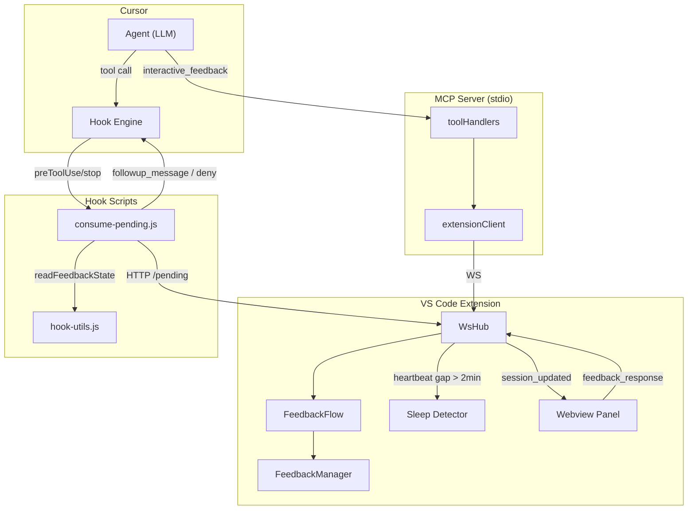
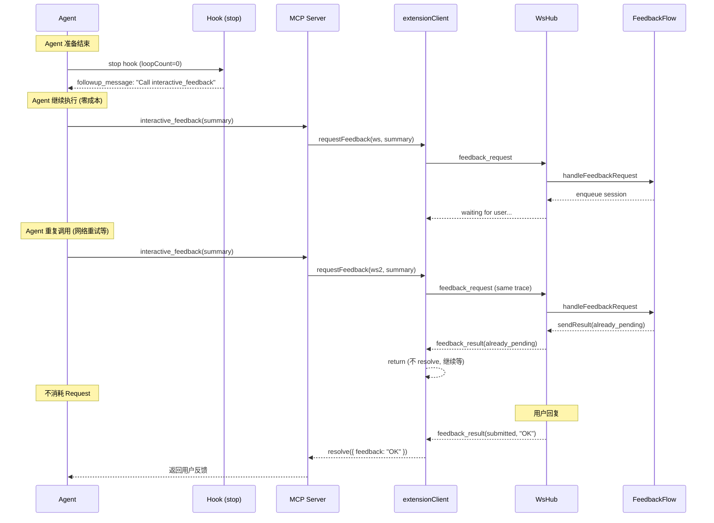

# 修复：Cursor Request 意外消耗

版本：`2.5.1-ji.90` | 日期：2026-07-04

## 问题现象

用户未主动发起请求，但 Cursor 使用记录中出现意外的 Request 消耗：
- Jul 3, 11:52 PM — 160.3K + 1.1M tokens（2 requests）
- Jul 3, 11:53 PM — 818K tokens（1 request）
- Jul 4, 02:23 AM — 4.2M tokens（1 request，用户已睡觉）

## 影响

每个意外 Request 消耗用户的 Cursor 配额。最严重的一次（02:23 AM）消耗了 4.2M tokens，完全无意义。

## 根因分析

### 直接原因

1. **enforcement `deny` 机制** — `preToolUse` hook 中的 `checkEnforcement` 在 Agent 执行超过 15 次工具调用或 5 分钟未调用 `interactive_feedback` 时，发出 `permission: deny`。Cursor 处理 deny 时会启动新的 Agent 轮次（携带全部上下文），消耗 1 个 Request。

2. **同 WS 重复 `interactive_feedback`** — Agent 有时重复调用 `interactive_feedback`（同一 WS 同一 trace）。旧实现通过 `sendError` 以错误完成工具调用 → Cursor 启动新轮次处理错误 → 消耗 1 个 Request。

3. **24h 超时 reject** — MCP 等待用户反馈超时时 `reject`（抛出错误）→ Agent 进入错误处理循环 → 消耗 Request。

4. **缺少 `stop` hook** — Agent 结束时无提醒，没有安全网确保 `interactive_feedback` 被调用。

### 02:23 AM 请求根因

旧的部署代码（`~/.config/mcp-feedback-enhanced/hooks/`）使用低阈值（`maxToolCalls=15`），且 `feedback-state.json` 从平面格式迁移到嵌套格式时读取 `lastFeedbackAt` 为 `undefined` → `minutesSince = Infinity` → 立即触发 enforcement deny → 消耗 4.2M token Request。

## 解决核心思路

**原则：永远不通过 `deny` 浪费 Request，改用零成本的 `followup_message` 或静默忽略。**

### 7 层保护

| 层 | 机制 | 原理 |
|----|------|------|
| 1 | `already_pending` 忽略 | extensionClient 不 resolve promise → Cursor 不启动新轮次 |
| 2 | `stop` hook + `followup_message` | 零成本注入提醒，不使用 `deny` |
| 3 | 超时 `resolve` | 返回 `{ status: 'timeout' }` 而非 `reject` |
| 4 | 高阈值 enforcement | 50 次 / 15 分钟，正常使用不触发 |
| 5 | per-workspace 状态 | 多窗口独立计数，互不干扰 |
| 6 | Sleep 检测 | 合盖恢复时弹出警告 |
| 7 | 全部本地通信 | 网络不稳定不影响插件 |

## 关键文件

| 文件 | 职责 | 改动 |
|------|------|------|
| `mcp-server/src/extensionClient.ts` | MCP↔Extension 通信 | `already_pending` 忽略，超时 resolve |
| `mcp-server/src/toolHandlers.ts` | MCP 工具调用处理 | 状态检查，重试减少 |
| `scripts/hooks/consume-pending.js` | Cursor hook 入口 | stop hook 逻辑，精简消息 |
| `scripts/hooks/hook-utils.js` | Hook 工具函数 | per-workspace 状态，阈值提高 |
| `src/server/feedbackFlow.ts` | 反馈请求生命周期 | `sendResult(already_pending)` |
| `src/server/wsHub.ts` | WS 中枢 | sleep 检测，`status` 字段 |
| `src/deploy/hooks.ts` | Hook 部署 | 重新启用 `stop` |
| `src/extension.ts` | Extension 入口 | sleep 警告回调 |

## 数据流动

### 正常 feedback 流

```
Agent → MCP (interactive_feedback)
  → extensionClient (WS connect)
  → wsHub (feedback_request)
  → feedbackFlow.handleFeedbackRequest
  → feedbackManager.enqueue
  → panel (session_updated)
  → user types reply
  → panel (feedback_response)
  → feedbackFlow.handleFeedbackResponse
  → feedbackManager.resolveBySessionId
  → wsHub.sendResult(submitted)
  → extensionClient (resolve promise)
  → toolHandlers (return feedback to Agent)
```

### already_pending 流（零成本）

```
Agent → MCP (interactive_feedback, 重复调用)
  → extensionClient (WS connect)
  → wsHub (feedback_request)
  → feedbackFlow: traceReuse.action === 'duplicate'
  → wsHub.sendResult({ status: 'already_pending' })
  → extensionClient: msg.status === 'already_pending' → return (不 resolve)
  → Agent 继续等待原 promise → 不消耗新 Request
```

### stop hook 流（零成本）

```
Agent 准备结束 → Cursor stop hook
  → consume-pending.js (hook=stop)
  → loopCount < 3 → consumePending(port)
  → 如有 pending → followup_message(fmtAgent(pending))
  → 如无 pending → followup_message('Call interactive_feedback...')
  → Agent 继续执行 → 不消耗新 Request
```

## Mermaid 图

### 架构图



### 请求保护时序图



## 对比分析

参考仓库：`shenghanqin/mcp-feedback-enhanced-vscode-good`（`fix/cursor-single-feedback-session` 分支）

详见 [`compare_implement_for_waste_cursor_request.md`](./compare_implement_for_waste_cursor_request.md)

核心差异：对方从不使用 `deny`，通过 `already_pending` 不完成工具调用 + `followup_message` 零成本注入。我方已完全吸收这些经验。

## 测试覆盖

| 测试文件 | 覆盖内容 |
|----------|----------|
| `cursorRequestWaste.test.js` | timeout/submitted/ok 状态处理、already_pending sendResult、workspaceKey、stop hook 注册 |
| `sessionDedupe.test.js` | already_pending 行为、trace_steal、parallel traces |
| `feedbackFlow.test.js` | pipeline trace、stale session fallback |
| `toolHandlers.integration.test.js` | trace_id 传递、浏览器回退、连接重试 |
| `p569Refactor.test.js` | hooks 配置合并（含 stop 注册） |
