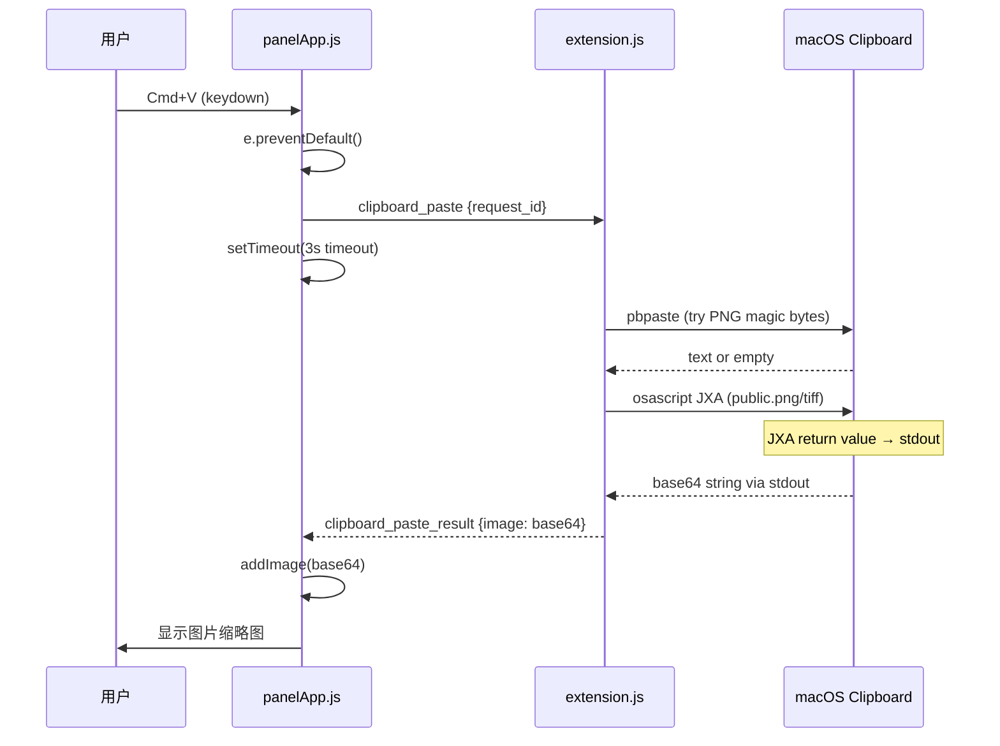
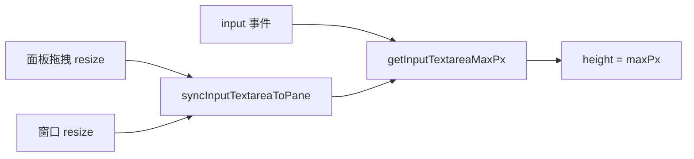
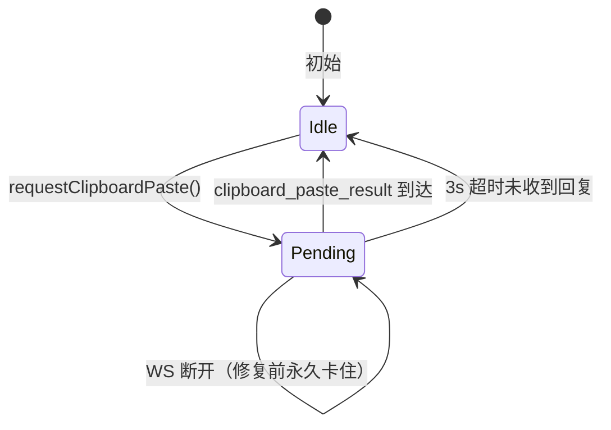

# Fix: 剪贴板图片粘贴失败 + 输入框缩小 + Paste 卡死 (ji.91)

> 日期: 2026-07-04 | 版本: v2.5.1-ji.91 | 影响: macOS 剪贴板图片从未工作过

## 问题描述

| # | 现象 | 严重度 |
|---|------|--------|
| 1 | 粘贴图片到反馈输入框，图片不出现 | P0 |
| 2 | 输入文字时 textarea 高度不断缩小至 48px | P1 |
| 3 | 偶发：paste 操作完全无响应（卡死） | P2 |

## 根因分析

### Bug 1: JXA `console.log` 输出到 stderr，代码只读 stdout

**数据流（修复前）：**

```
剪贴板 → osascript JXA → console.log(base64) → stderr（丢弃）
                                              ↳ stdout = ""（代码读到空）
```

`clipboardImage.ts` 中的 JXA 脚本使用 `console.log()` 输出 base64 编码的图片数据。
但在 macOS `osascript -l JavaScript` 环境中：
- `console.log()` → **stderr**
- 最后一行表达式的值 → **stdout**

Node.js `execFileAsync` 只读 `stdout`，所以永远得到空字符串。

**日志证据：** extension.log 中 `image=true` 的记录数 = **0**（图片粘贴从未成功）

**附带问题：** 诊断脚本 `$.NSPasteboard.generalPasteboard.types.js` 也有问题 —— `.js` 桥接 NSString 到 JS 返回 null，导致类型日志全是 `[null,null,...]`。

### Bug 2: `autoGrowTextareaHeight` 让空 textarea 缩到 48px

`panelApp.js` 的 `input` 事件处理器调用 `autoGrowTextareaHeight(el, {minPx:48, maxPx})`。当 textarea 内容为空或很少时：

1. `scrollHeight` 返回很小的值（只有 padding）
2. `Math.max(minPx, scrollHeight)` = 48
3. textarea 缩到 48px，但面板仍然是原来的高度 → 大片空白

### Bug 3: `__mcpWsPastePending` 永久卡死

`requestClipboardPaste()` 设置 `__mcpWsPastePending = true`，等待 `clipboard_paste_result` 回复后重置。但如果 WebSocket 在发送请求后断开，回复永远不会到达，标志永久为 true。

后续所有 paste 事件都被 `shouldBlockDuplicatePaste(pending=true, ...)` 拦截。

## 修复方案

### Fix 1: JXA 使用 return value + `ObjC.unwrap()`

```javascript
// 修复前（stderr）:
if(d){console.log($.NSData.alloc.initWithData(d).base64EncodedStringWithOptions(0).js);break;}

// 修复后（stdout via return value）:
if(d){result=ObjC.unwrap($.NSData.alloc.initWithData(d).base64EncodedStringWithOptions(0));break;}
// ...
result;  // 最后一行表达式 → stdout
```

同时诊断脚本改用 `ObjC.unwrap()` + `objectAtIndex()` 正确读取 pasteboard 类型名。

### Fix 2: textarea 直接设置 `height = maxPx`

textarea 应始终填满输入面板的可用空间，不需要 auto-grow 缩小逻辑：

```javascript
// 修复前:
PS.PanelState.autoGrowTextareaHeight(inputEl, { minPx: 48, maxPx: maxPx });

// 修复后:
inputEl.style.height = getInputTextareaMaxPx() + 'px';
```

### Fix 3: 3 秒超时自动重置 paste pending

```javascript
setTimeout(function () {
    if (window.__mcpPendingPasteId === rid) {
        window.__mcpPendingPasteId = null;
        window.__mcpWsPastePending = false;
    }
}, 3000);
```

用 closure 捕获 `rid` 防止竞态：如果新的 paste 请求已发出，旧的超时不会误清新请求。

## 关键文件

| 文件 | 改动 |
|------|------|
| `src/utils/clipboardImage.ts` | JXA 脚本 return value + ObjC.unwrap |
| `static/panelApp.js` | textarea height 直接赋值 + paste 超时 |
| `out/extension.js` | esbuild 重新构建包含 TS 修复 |

## 数据流

### 图片粘贴数据流（修复后）



### textarea 高度管理



### paste pending 状态机



### Bug 4: `_onSessionUpdated` 重复消息 (ji.92 追加修复)

`_onSessionUpdated` 每次收到 `session_updated` 事件都无条件 push AI 消息。
bridge 重连时同一事件到达多次 → 消息列表出现 3 个一模一样的 AI 消息气泡。

**修复：** 添加与 `_onStateSync` 一致的去重检查：

```javascript
if (!lastMsg || lastMsg.role !== 'ai' || lastMsg.content !== sumText) {
    sess.messages.push({ role: 'ai', content: sumText, ... })
}
```

## 已知遗留问题

| 问题 | 类型 | 影响 |
|------|------|------|
| 右键 → Paste 文本时被 `extensionClipboardReady()` 吞掉 | 预存 bug | 低：用户习惯 Cmd+V |
| Windows 不支持剪贴板图片 | 功能缺失 | 需要 PowerShell 实现 |
| `autoGrowTextareaHeight` 无调用者但仍有测试覆盖 | 死代码 | 保留：测试/e2e 引用 |
| `forceReconnect` 后 bridge 连接突发洪泛 (~60 次/20s) | 性能 | 低：自动停止 |

## 测试覆盖

- `tests/clipboardImage.test.js` — 非 darwin 返回 null ✅
- `tests/panelPaste.test.js` — shouldBlockDuplicatePaste 逻辑 ✅
- `tests/panelClipboard.test.js` — extractClipboardImages 提取 ✅
- `tests/sessionsMarkdown.test.js` — autoGrowTextareaHeight 边界 ✅
- `e2e/panel-health.spec.cjs` — autoGrowTextareaHeight DOM 行为 ✅

**测试缺口：** JXA stdout/stderr 行为需要 macOS 环境，3s 超时和 textarea height 需要 DOM 环境，无法在纯 Node.js 测试中覆盖。已通过终端手动验证 JXA 修复。
