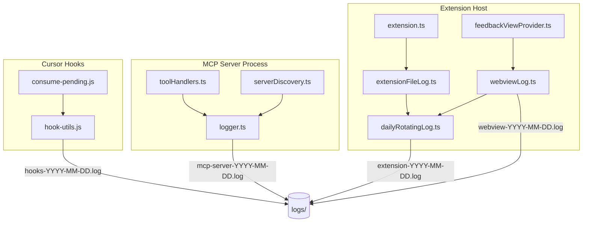
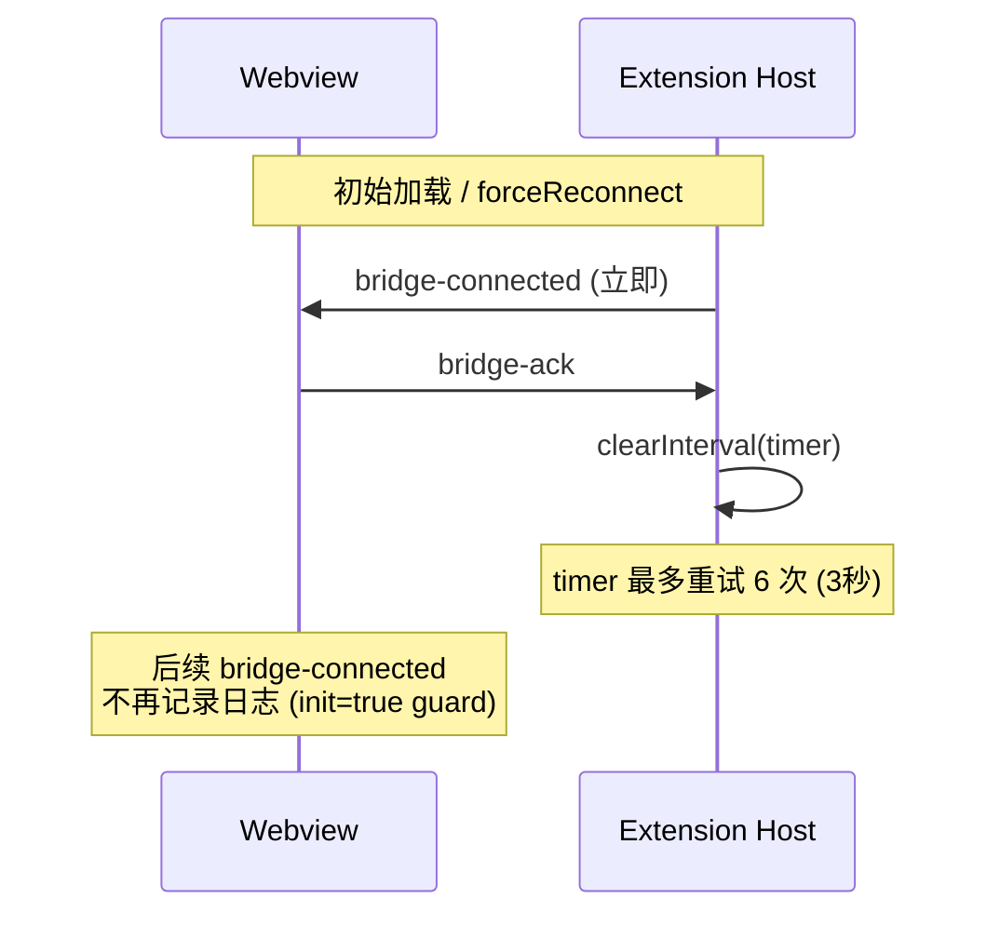
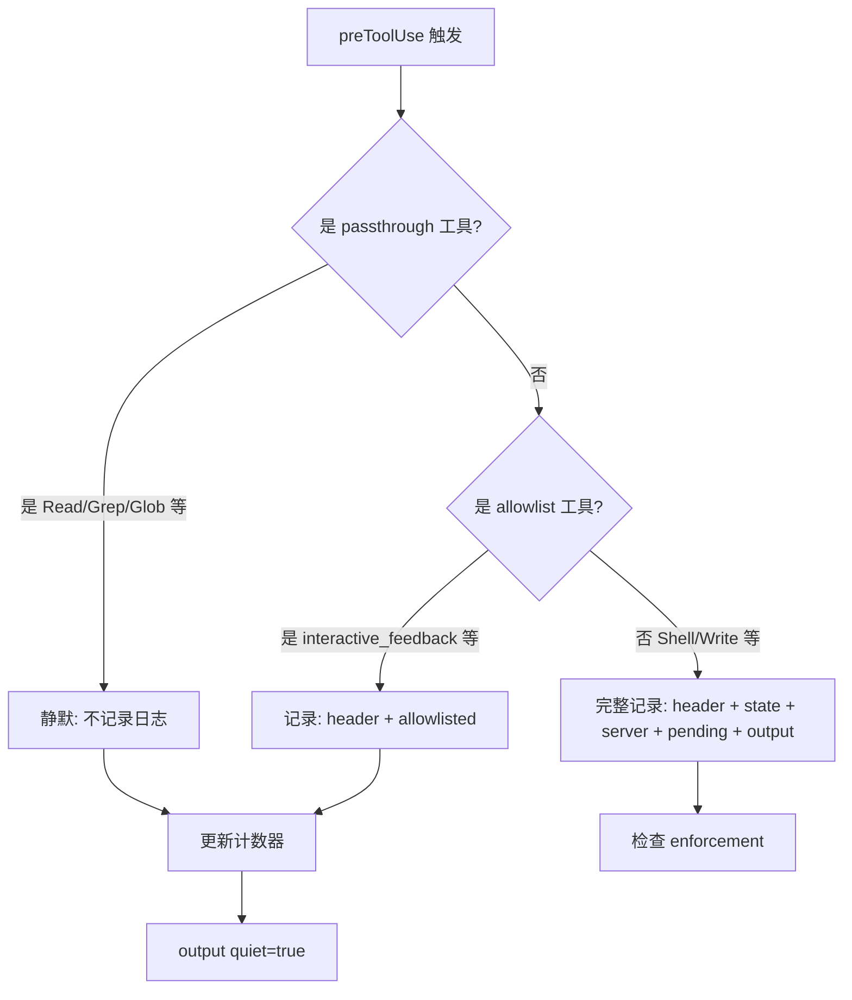

# 日志可观测性优化 (2026-07-04)

## 问题概述

reload 后分析四大日志子系统（extension / mcp-server / webview / hooks），发现以下问题：

| 编号 | 严重级 | 问题 | 影响 |
|------|--------|------|------|
| 1 | 严重 | onBridgeConnected 广播风暴 | webview 日志 60% 为无意义重复 |
| 2 | 中 | `_instance.lock.json` discovery 噪声 | mcp-server 每次请求多 96 条无用日志 |
| 3 | 中 | hooks.log passthrough 工具过度记录 | 32K 行/天，2.2M 日志量 |

## 解决方案

### 1. Bridge 广播上限收紧

**问题现象**：`forceReconnect` 后 extension 每 500ms 广播 `bridge-connected`，最多 30 次（15 秒）。bridge-ack 机制已在 ji.93 引入但 max=30 仍然过高。

**核心修复**：将 `_broadcastBridgeConnected` 最大重试次数从 30 降至 6（3 秒），配合 bridge-ack 立即停止。

**关键文件**：`src/feedbackViewProvider.ts`

```
30 次 × 500ms = 15 秒 → 6 次 × 500ms = 3 秒
```

### 2. Discovery 过滤内部文件

**问题现象**：`_instance.lock.json` 是进程锁文件，不是服务注册。但 `listJSONFiles` 会列出所有 `.json`，导致对锁文件做 `fetchHealth()` HTTP 请求和日志输出。

**核心修复**：`listJSONFiles` 增加 `!f.startsWith('_')` 过滤，排除内部文件。

**关键文件**：`mcp-server/src/serverDiscovery.ts`

### 3. Hooks 日志静默 passthrough 工具

**问题现象**：`Read`、`Grep`、`Glob` 等高频只读工具每次调用记录 3 行日志（header + allowlisted + output），32K 行/天。

**核心修复**：
- 识别 passthrough 工具（Read/Grep/Glob/SemanticSearch 等）
- 跳过 header 日志、allowlisted 日志、output 日志
- 仅保留计数器更新（确保 enforcement 机制不受影响）

**关键文件**：`scripts/hooks/consume-pending.js`、`scripts/hooks/hook-utils.js`

## 数据流与架构

### 日志子系统架构



### Bridge 连接时序



### Hook 日志决策流



## 日志轮转策略（统一）

| 子系统 | 文件名格式 | 轮转 | 清理 |
|--------|-----------|------|------|
| Extension | extension-YYYY-MM-DD.log | 按日 | 7 天 |
| MCP Server | mcp-server-YYYY-MM-DD.log | 按日 | 7 天 |
| Webview | webview-YYYY-MM-DD.log | 按日 | 7 天 |
| Hooks | hooks-YYYY-MM-DD.log | 按日 | 7 天 |

每个子系统维护一个不含日期的 symlink（如 `extension.log` → `extension-2026-07-04.log`）方便快速查看。

## 测试覆盖

| 测试文件 | 测试数 | 覆盖内容 |
|---------|--------|---------|
| extensionFileLog.test.js | 3 | 日轮转、symlink、无 2MB 轮转 |
| feedbackWaitHeartbeat.test.js | 12 | 对数节流 1/2/5/10/30/60 分钟 |
| clientRegistry.staleLog.test.js | 1 | stale sweep 写入文件日志 |
| logPaths.test.js | 3 | 日志路径解析 |
| toolHandlers.test.js | 10 | MCP 工具核心路径 |
| hookUtils.test.js | 12 | hook 工具函数 |
| serverDiscovery.test.js | 23 | 服务发现逻辑 |

**全套测试**：374 pass / 0 fail

## 预期效果

| 指标 | 修复前 | 修复后 |
|------|--------|--------|
| webview 日志 onBridgeConnected 行数 | ~372 行/天 | ~10 行/天 |
| mcp-server `_instance.lock` 日志 | ~96 行/天 | 0 |
| hooks.log 总行数 | ~32K 行/天 | ~5K 行/天 |
| hooks.log 文件大小 | ~2.2M/天 | ~350K/天 |
