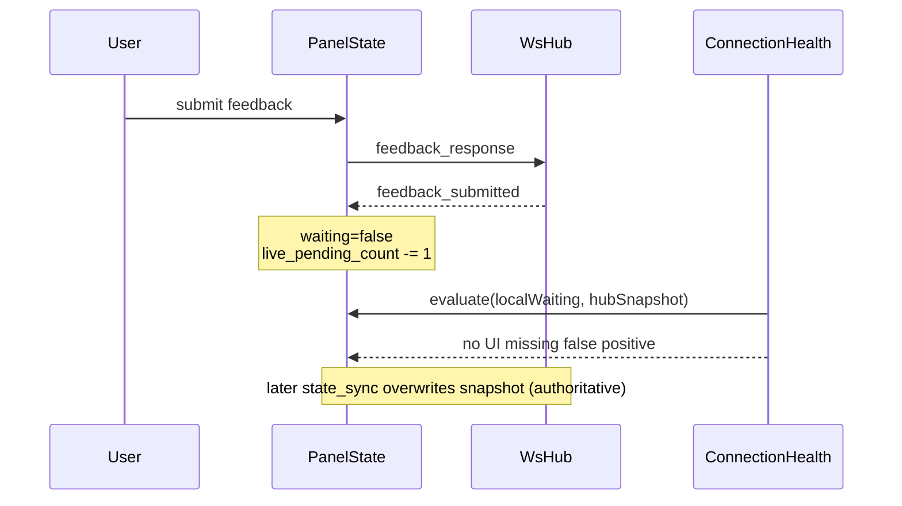
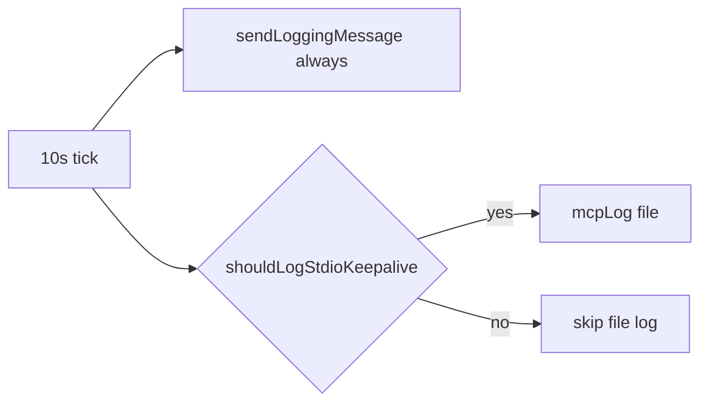
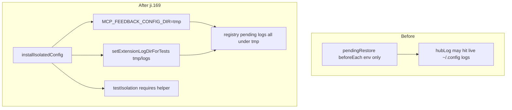

# fix_log_2 — 2026-07-14 三项优化（ji.170）

## 1. 问题是什么

同一晚（约 22:42–23:42 +08）对照插件日志与 Cursor Usage，确认：

| 现象 | 性质 |
|------|------|
| `connection_health issues=UI missing 1 waiting tab(s) — click Reconnect` | **误报**：用户刚提交反馈后、下一轮 Agent 尚未再次 `feedback_request` 时出现 |
| `event=stdio_keepalive` 约每 10s 一行 | **日志噪音**：协议心跳必要，文件落盘过密 |
| `version=pending-restore-it` 写入 `~/.config/.../extension-*.log` | **测试污染**：集成测试日志落入 live 配置目录 |

另：Cursor Usage 中 03:26/03:43 PM UTC 的 3.8M / 980K token（各 1 request）对应当日 Agent 对话本身，**不是**测试污染、也不是 enforcement（ji.168 已移除）。

## 2. 影响是什么

1. **误报**诱导用户无意义点 Reconnect，干扰真实断连判断。
2. **keepalive 日志**拉高 mcp-server 日日志体量，排查真实异常时信噪比下降。
3. **测试污染**混进生产 extension 日志（甚至可能抢占/交错 registry），干扰线上排障。

## 3. 解决的核心思路

1. **权威最终仍是 Hub `state_sync`**，但在 `feedback_submitted` 到达 UI 时，对本地 snapshot 做 **一次性递减**，覆盖「提交后 → 下次 sync」窗口。
2. **协议与落盘解耦**：stdio 出站仍 10s；落盘用与 wait-heartbeat 同风格的稀疏 tick 策略。
3. **隔离助手一次做对**：`MCP_FEEDBACK_CONFIG_DIR` + `setExtensionLogDirForTests` + logger reset；护栏只认 `installIsolatedConfig`。

## 4. 关键文件

| 文件 | 职责 |
|------|------|
| `static/panelState.js` | `_decrementHubPendingSnapshot` / `_onFeedbackSubmitted` |
| `static/panelStateTransport.js` | `ConnectionHealth.evaluate`（消费 snapshot，未改判定公式） |
| `mcp-server/src/feedbackWait.ts` | `shouldLogStdioKeepalive` |
| `mcp-server/src/stdioKeepalive.ts` | tick 计数 + 条件 `mcpLog` |
| `tests/helpers/isolatedConfig.js` | 统一隔离 config + extension logs |
| `tests/pendingRestore.integration.test.js` | 改用 helper + 日志路径回归 |
| `tests/testIsolation.test.js` | 强制 `installIsolatedConfig` |
| `tests/panelState.test.js` | snapshot 递减 / 去重 / ConnectionHealth 断言 |
| `tests/mcpStdioKeepalive.test.js` | 节流单测 |
| `changelog.md` / `package.json` | ji.169 |

## 5. 设计与数据流

### 5.1 UI missing 误报修复



### 5.2 stdio keepalive 分层



### 5.3 测试隔离架构



## 6. 使用方法

部署后 Reload Window：

```bash
npm run deploy   # 或 Install from VSIX ji.169+
# Cmd+Shift+P → Developer: Reload Window
```

验证误报消失（提交后短暂窗口不应再刷 UI missing）：

```bash
rg "UI missing" ~/.config/mcp-feedback-enhanced/logs/webview-$(date +%Y-%m-%d).log | tail
```

验证 keepalive 文件日志变稀：

```bash
rg -c "stdio_keepalive" ~/.config/mcp-feedback-enhanced/logs/mcp-server-$(date +%Y-%m-%d).log
```

跑相关测试：

```bash
node --test tests/panelState.test.js tests/mcpStdioKeepalive.test.js \
  tests/testIsolation.test.js tests/pendingRestore.integration.test.js
```

## 7. 三轮 Review 记录

### Round 1 — 因果与必要性

| 改动 | 必要？ | 因果是否闭环 | 结论 |
|------|--------|--------------|------|
| snapshot 递减 | 是 | 日志显示提交后 `waiting_cleared` 但 health 仍用旧 live=1 | 保留 |
| keepalive 只降文件日志 | 是 | 协议层必须 10s，噪音在 mcpLog | 保留 |
| installIsolatedConfig 强制 | 是 | pendingRestore 曾写 live extension log | 保留 |

未做整表 `hubSnapshot=null`：会清掉 port/workspaces，引入更多 mis-health。

### Round 2 — 边界与测试覆盖

| 边界 | 处理 | 测试 |
|------|------|------|
| 双 waiting 只提交一个 | live 2→1，另一 tab 仍 waiting | `decrements once per waiting session` |
| 重复 `feedback_submitted` | `wasWaiting` 门闸，只递减一次 | `does not decrement twice` |
| hubSnapshot=null | no-op | `tolerates missing hubSnapshot` |
| keepalive tick 3/7 | 协议仍发，文件 3 条 | `always sends protocol... throttles file` |
| 日志不写 live home | assert logsDir 前缀 | `writes hub logs under isolated...` |

遗漏已补：`installIsolatedConfig` setup 时先 `reset` 再 `set` 再 `reset`，避免旧 logger flush 到错误目录。

### Round 3 — 可维护性 / DRY / 分层

- **单一职责**：递减逻辑抽 `_decrementHubPendingSnapshot`；节流纯函数 `shouldLogStdioKeepalive`；隔离集中在 helper。
- **DRY**：节流策略对齐 `shouldLogHeartbeat` 风格，不另起配置文件。
- **耦合**：UI 只改本地缓存，Hub 真值仍靠 sync；测试不读生产路径。
- **文件体量**：未新增巨型模块；改动局部。
- **前端竞态**：递减与 `wasWaiting` 同临界区；重复 submitted 安全。无新增网络缓存层。
- **TS**：`feedbackWait.ts` / `stdioKeepalive.ts` 有明确类型；`opts?.log` 仅测试注入。
- **跨平台**：路径用 `path`/`os.homedir`；无 Mac/Win 特判依赖。
- **非 REST 服务**：无新增 API / swagger 需求。

**残留（刻意不做）**

- `shouldSkipRulesRefresh` 命名仍偏历史（duplicate wait）；与本任务无关。
- `updateCounter` / `toolsSinceFeedback` 在 enforcement 移除后仅日志用途；本轮不扩 scope。
- 双击 `forceReconnect`：属操作/UI 节流，未纳入本修复。

## 9. 日志对照与最小风险加固（同日追加）

### 日志结论（加固前）

- 运行时仍是 **v=2.5.1-ji.168**，ji.169 未 deploy 前无法用线上日志验证 snapshot 递减。
- 误报因果在代码路径上已闭合；最大残余风险是「递减了 snapshot 但健康条要等下次定时 render」→ 已补 **立即 `renderConnectionHealth()`**。

### 最小加固（KISS）

1. `feedback_submitted` 日志：`waiting_count` + `hub_live_pending` + `hub_pending`（排障可直接 grep）。
2. 提交后立刻刷新 connection health（避免定时器窗口仍显示 degraded）。
3. `stdio_keepalive` 文件行带 `tick=N`。
4. 单测：`state_sync` 覆盖乐观递减；panelApp 结构回归断言 `renderConnectionHealth` + 字段。

### 竞态说明（单线程 JS）

- 递减与 `wasWaiting` 同同步临界区；重复 `feedback_submitted` 不会二次递减。
- 随后 `state_sync` 整表覆盖 snapshot（权威）。无跨线程共享可变缓存。

## 8. 与 ji.168 的关系

- **ji.168**：移除 enforcement 自动 `followup_message`，停止非用户发起的 feedback 循环浪费 request。
- **ji.169**：修面板健康误报、日志噪音、测试隔离；不改变 request 计费主路径。
