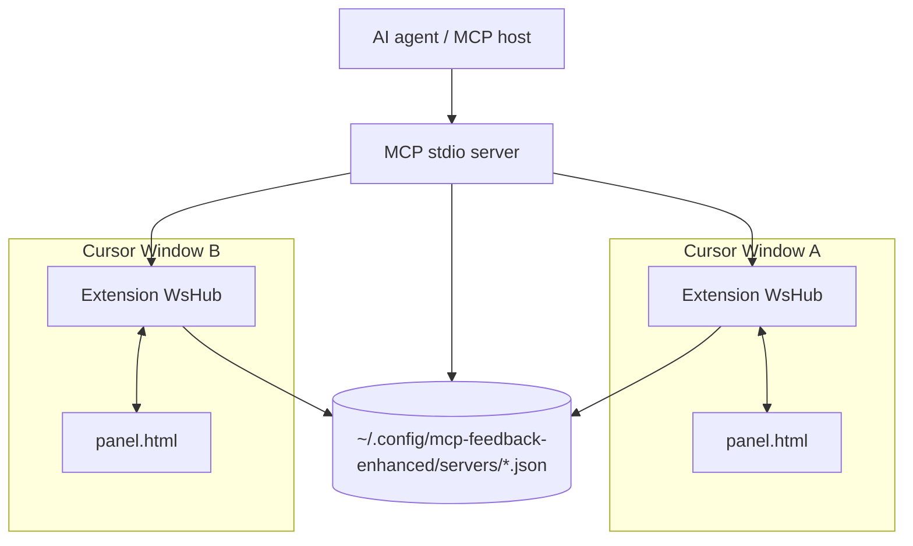
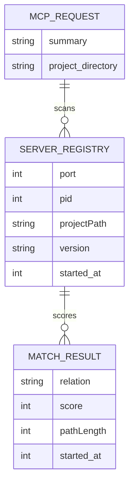
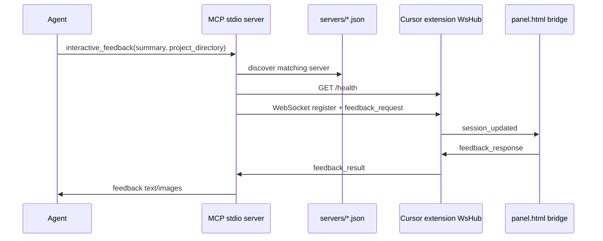
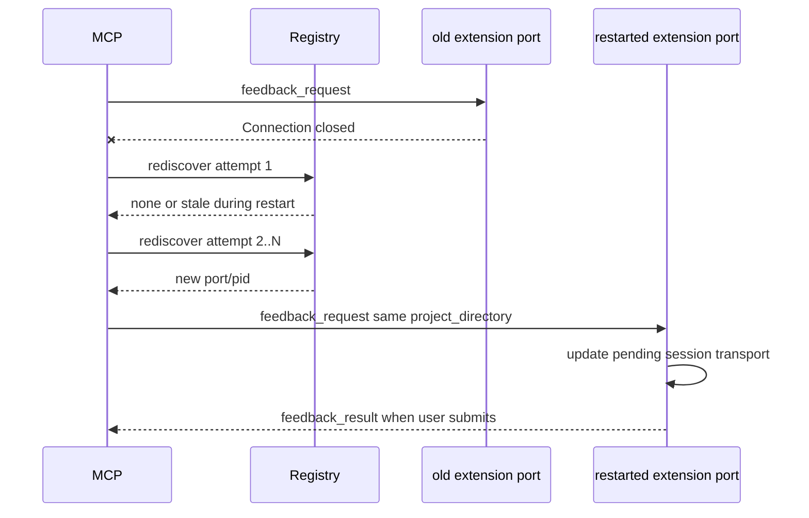

# MCP Workspace Match And Reconnect Notes

## 问题

Cursor 可以同时打开多个不同项目。每个项目里的扩展面板会启动本地 WebSocket/HTTP 服务，并把 `{ port, pid, projectPath, version }` 写入 `~/.config/mcp-feedback-enhanced/servers/*.json`。MCP stdio 进程调用 `interactive_feedback` 时，需要按 `project_directory` 找到正确的扩展服务。

日志里出现过四类问题：

1. 子目录项目被判定为 `project_mismatch`，例如请求 `/Users/hunter/Workspace/llm-gateway/provider_mock` 时，已有扩展注册在父目录 `/Users/hunter/Workspace/llm-gateway`。
2. 扩展或 panel 重连时，registry/health 短暂为空，MCP 侧第一次 `Connection closed` 后立刻放弃，导致 `Extension unavailable, browser fallback disabled`。
3. MCP stdio 启动日志只有 `Server started`，没有版本号，且 SDK metadata 版本曾硬编码为 `2.0.0`，排查部署版本很困难。
4. 单个 Cursor 窗口打开多个 workspace root 时，会写多个 registry 文件但指向同一个 `port/pid`；如果 MCP 调用没有传 `project_directory`，旧逻辑会把这些文件误判为多个不同扩展服务。

## 影响

- 多 Cursor 窗口、多 workspace、子目录工具调用时，反馈请求可能找不到对应 panel。
- 扩展服务重启或 panel reload 的短暂窗口会把一个可恢复请求变成失败请求。
- 启动日志缺少版本号时，无法确认 Cursor 实际加载的是当前修复后的 MCP server。
- 单个多根 workspace 的 Cursor 窗口可能因为无项目目录而误失败。

## 核心思路

- registry 匹配不只看完全相等，还识别 `exact / ancestor / descendant`。
- 多个候选时按确定性评分选择：exact > descendant > ancestor，同分时选更长路径，再按 `started_at` 选最新。
- 没有 `project_directory` 时仍然保守：多个不同 `port/pid` 不随机选；但多个 registry 都指向同一个 `port/pid` 时视为同一扩展实例，可以路由。
- MCP 侧连接关闭后不立即失败，而是在同一次 `interactive_feedback` 调用内做有限 rediscovery，给扩展服务重启和 registry 重写留恢复窗口。
- MCP server 版本从 `MCP_FEEDBACK_VERSION` 或 `mcp-server/package.json` 读取，并在启动日志打印。
- panel 仍优先使用 in-process bridge，WebSocket 只是 fallback，不扩大前端连接面。
- 本地 HTTP 诊断 API 默认提供 `GET /openapi.json` 和 `GET /docs`，无外部依赖。

## 关键文件

- `mcp-server/src/serverDiscoveryCore.ts`: workspace 路径关系、候选排序、子目录/父目录兼容。
- `mcp-server/src/serverDiscovery.ts`: 读取 registry、health check、项目匹配日志。
- `mcp-server/src/toolHandlers.ts`: `interactive_feedback` 的有限重发现和重连等待。
- `mcp-server/src/index.ts`: MCP server 版本读取和启动日志。
- `src/server/feedbackManager.ts`: 扩展端 pending session 在旧 MCP transport 关闭后允许同项目新 transport 接管。
- `src/server/wsHub.ts`: 扩展本地服务、registry 写入、webview bridge。
- `src/server/httpRoutes.ts`: `/health`、`/pending`、`/openapi.json`、`/docs`。
- `static/panel.html`: panel 端 bridge 优先、WebSocket fallback。
- `tests/serverDiscovery.test.js`, `tests/feedbackManager.test.js`, `tests/mcpReconnect.test.js`, `tests/mcpServerVersion.test.js`, `tests/httpRoutes.test.js`: 回归测试。

## 架构图



## 数据流

```mermaid
flowchart LR
  A[Cursor project window] --> B[VS Code extension activation]
  B --> C[WsHub starts HTTP/WebSocket]
  C --> D[servers/project-hash.json]
  E[MCP stdio server] --> F[interactive_feedback]
  F --> G[findExtensionServer project_directory]
  G --> D
  G --> H[/health on candidate port]
  H --> I[connectToExtension WebSocket]
  I --> J[feedback_request]
  J --> K[panel via in-process bridge]
  K --> L[feedback_result]
  L --> E
```

## Registry 数据关系



## 调用时序



## 重连时序



## 核心 Discovery 代码片段

`mcp-server/src/serverDiscoveryCore.ts`

```ts
export function projectPathRelation(entryPath: string | undefined, want: string | undefined): ProjectPathRelation {
    if (!want) return 'exact';
    if (!entryPath) return 'none';
    const entry = normalizeProjectPath(entryPath);
    const target = normalizeProjectPath(want);
    if (entry === target) return 'exact';
    if (target.startsWith(entry + path.sep)) return 'ancestor';
    if (entry.startsWith(target + path.sep)) return 'descendant';
    return 'none';
}
```

```ts
function pickSingleServerIdentity(candidates: ServerData[]): ServerData | null {
    const identities = new Set(candidates.map((server) => `${server.port}:${server.pid}`));
    if (identities.size !== 1) return null;
    return [...candidates].sort((a, b) => (b.started_at || 0) - (a.started_at || 0))[0];
}
```

选择规则：

1. 有 `project_directory`：只接受 `exact / ancestor / descendant`。
2. 多个匹配：`exact` 优先，其次 `descendant`，再是 `ancestor`；同分选更长路径，再选更新 `started_at`。
3. 无 `project_directory`：单候选直接选；多个候选只有在全部指向同一 `port:pid` 时才选，否则返回 `null`。

## 核心 Retry 代码片段

`mcp-server/src/toolHandlers.ts`

```ts
async function rediscoverExtensionServer(
    deps: ToolHandlerDeps,
    projectDirectory: string | undefined,
    log: (msg: string) => void,
): Promise<ServerData | null> {
    const attempts = deps.rediscoveryAttempts ?? DEFAULT_REDISCOVERY_ATTEMPTS;
    const retryDelayMs = deps.retryDelayMs ?? DEFAULT_RETRY_DELAY_MS;

    for (let i = 1; i <= attempts; i++) {
        const server = await deps.findExtensionServer(projectDirectory, log);
        if (server) return server;
        if (i < attempts) {
            deps.log(`[MCP Feedback] rediscover ${i}/${attempts} found no extension; retrying`);
            await sleep(retryDelayMs);
        }
    }
    return null;
}
```

`interactive_feedback` 先 rediscover，再连接扩展；连接或等待反馈失败后，再 rediscover 一轮。这个 retry 只给扩展重启、registry 重写、health 短暂失败留窗口，不改变最终路由规则。

## HTTP 诊断 API

`src/server/httpRoutes.ts`

| Endpoint | Purpose |
| --- | --- |
| `GET /health` | 返回 `{ ok, port, pid, version }`，供 discovery 做 health check。 |
| `GET /pending` | 查看 pending feedback。 |
| `GET /pending?consume=1` | 消费 pending feedback。 |
| `GET /openapi.json` | OpenAPI 3.0 JSON。 |
| `GET /docs` | 轻量 HTML 文档页，包含 curl 示例。 |

这些 endpoint 都绑定在 `127.0.0.1` 的扩展本地服务上，不引入新依赖，也不暴露外网。

## 场景矩阵

| 场景 | 输入 | 期望行为 | 覆盖 |
| --- | --- | --- | --- |
| 单项目精确匹配 | registry `/repo`, request `/repo` | 选该扩展 | `serverDiscovery.test.js` |
| 子目录工具调用 | registry `/repo`, request `/repo/sub` | 父 workspace 作为 ancestor 可匹配 | `serverDiscovery.test.js` |
| 更精确子项目存在 | registry `/repo` + `/repo/sub`, request `/repo/sub` | 选 exact `/repo/sub` | `serverDiscovery.test.js` |
| 多个父目录匹配 | registry `/Users/hunter/Workspace` + `/Users/hunter/Workspace/llm-gateway` | 选最近 ancestor | `serverDiscovery.test.js` |
| sibling 前缀 | `/repo/app` vs `/repo/app2` | 不匹配 | `serverDiscovery.test.js` |
| 无 project + 多 Cursor | 不同 `port/pid` | 返回 null，避免随机投错 | `serverDiscovery.test.js` |
| 无 project + 单 Cursor 多根 workspace | 多 registry 同 `port/pid` | 允许路由到该扩展 | `serverDiscovery.test.js` |
| 扩展重启窗口 | 第一次 close 后 discovery 暂空再恢复 | retry 后成功 | `mcpReconnect.test.js` |
| retry 耗尽 | discovery 始终为空 | 返回 extension unavailable | `mcpReconnect.test.js` |
| 启动版本 | MCP stdio start | 打印 `Server started version=<version>` | `mcpServerVersion.test.js` |
| HTTP docs | `/openapi.json`, `/docs` | 返回 OpenAPI 和文档 HTML | `httpRoutes.test.js` |

## 日志判读

- `feedback_request start project=<path>`：MCP tool call 开始 discovery。
- `discover: accept port=<port> pid=<pid> source=<file>`：registry entry 进候选。
- `discover: skip ... reason=project_mismatch have=<path> want=<path>`：项目路径无 ancestor/descendant/exact 关系。
- `feedback_request candidates=<port>:<pid>(...)`：最终候选。
- `[MCP Feedback] rediscover x/N found no extension; retrying`：扩展重启或 registry 短暂为空，MCP 仍在恢复窗口内。
- `[MCP Feedback] Server started version=<version>`：MCP stdio server 版本确认。

## 使用和排查

1. 调用 `interactive_feedback` 时尽量传真实 `project_directory`。多 Cursor 窗口下如果不传项目目录，代码不会随机选择一个候选，避免把反馈送到错误项目。
2. 启动日志应出现：`[MCP Feedback] Server started version=<version>`。
3. 子目录请求应能匹配父 workspace，例如 `/repo/subdir` 可以匹配注册在 `/repo` 的扩展服务。
4. 如果连接关闭后马上看到 registry 暂空，日志应出现 `rediscover x/N found no extension; retrying`，随后在扩展恢复后继续连接。
5. 本地 API 文档可打开 `http://127.0.0.1:<port>/docs`，OpenAPI JSON 为 `http://127.0.0.1:<port>/openapi.json`。
6. 如果仍然失败，重点看 `~/.config/mcp-feedback-enhanced/logs/extension.log`、Cursor MCP 输出、以及 `servers/*.json` 里的 `projectPath/port/pid/version`。

## 验证

- RED: `tests/mcpReconnect.test.js` 在旧实现中失败，因为第一次 close 后发现为空就直接返回 error。
- GREEN: 有限 rediscovery 后，同一次 tool call 会重新找到恢复后的扩展并拿到反馈。
- RED: `tests/mcpServerVersion.test.js` 在旧实现中失败，因为存在 `version: '2.0.0'` 和无版本启动日志。
- GREEN: MCP server metadata 和日志都使用实际版本。
- RED: `tests/httpRoutes.test.js` 在旧实现中失败，因为没有 `/openapi.json` 和 `/docs`。
- GREEN: 本地 HTTP 诊断 API 默认提供 OpenAPI JSON 和轻量 docs 页面。
- 全量验证：`npm test` 通过，包含 compile、webview runtime validation 和 70 个 node tests。

## 三轮 Review 结论

1. 因果逻辑：日志里的 `Connection closed` 后接 `candidates=none` 是可恢复断连窗口，MCP 侧有限 rediscovery 与扩展端 pending transport 接管机制形成闭环；不是盲目重试。
2. 边界场景：多 Cursor 窗口无 `project_directory` 仍不随机路由；单 Cursor 多 workspace root 的同 `port/pid` registry 不再误失败；sibling 前缀不会误匹配。
3. 可维护性：discovery 只负责路径关系和候选选择，retry 只负责恢复窗口，HTTP docs 只描述本地诊断 API。没有新增依赖，性能开销限定在失败恢复路径；正常路径仍是一次 discovery + 一次 health + 一次 WebSocket 请求。

## 剩余风险

- 当 `project_directory` 缺失且同时存在多个不同 `port/pid` 扩展服务时，无法证明哪个项目是正确目标；当前设计选择保守失败，不随机路由。
- 外部 MCP host 如果设置了较短 tool-call 超时，用户长时间不提交反馈仍可能被 host 取消；本修复解决的是扩展重启/registry 短暂为空导致的可恢复断连。
- 已安装到 Cursor 的扩展需要加载新的编译产物后，日志里才会出现本次版本和 rediscovery 行为。
