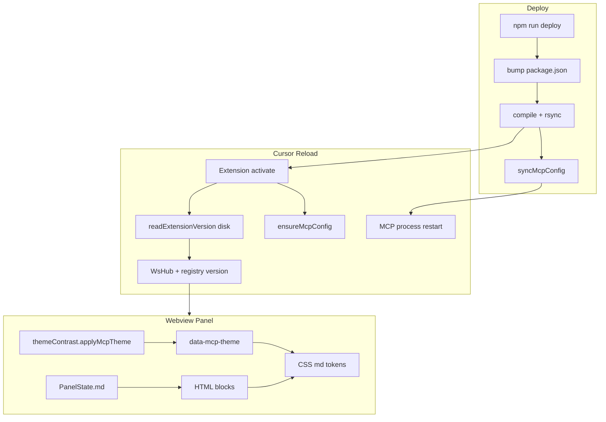
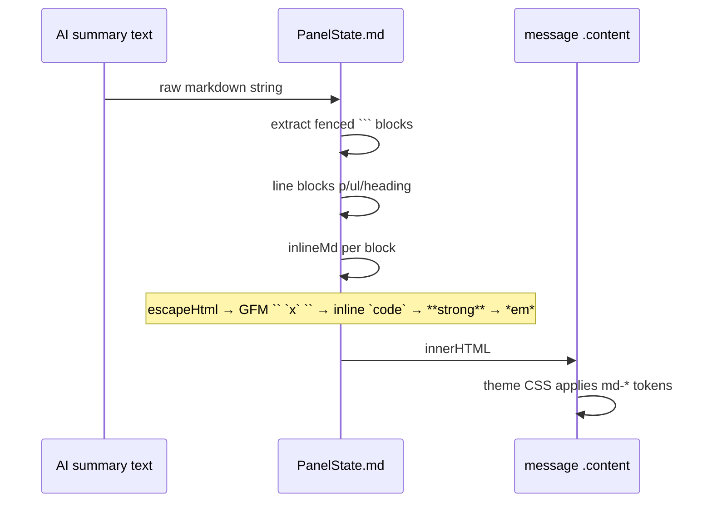

# optimize_1 — Deploy / Markdown / Contrast 优化复盘

## 1. 问题概览

| 现象 | 影响 | 根因 |
|------|------|------|
| deploy 后需 Reload 两遍才看到新版本 | 开发迭代慢、易误判 deploy 失败 | Cursor 缓存 `context.extension.packageJSON`；MCP 子进程不随 Reload 重启 |
| 面板版本号停留在 ji.17 | 无法确认是否加载新扩展 | 同上，registry 写入旧 version |
| Markdown 连续 `<br>`、列表间距大 | AI 消息难读 | `PanelState.md` 全局 `\n → <br>` |
| 行内 code / 粗体对比度低 | 浅色主题下「白字浅底」 | 硬编码颜色 + VS Code preformat 变量在 webview 不可靠 |
| commit 两侧空蓝框 | 误以为渲染损坏 | `` `commit` `` 被拆成 `` ` `` + `` `commit` `` + `` ` ``，空格 span 渲染为空 `<code>` |

## 2. 解决思路（KISS）

1. **版本**：`readExtensionVersion()` 每次从磁盘读 `package.json`；deploy 同步 `MCP_FEEDBACK_VERSION` 到 `~/.cursor/mcp.json`。
2. **Markdown**：块级解析（`p/ul/pre/h*`），去掉全局 `<br>`；GFM `` `word` `` 转字面量；空白 `` ` `` 丢弃。
3. **对比度**：`themeContrast.js` 检测编辑器背景 → `data-mcp-theme=light|dark` → 固定 token 表。
4. **可测性**：纯函数抽到 `extensionVersion.ts`；`PanelState.md` / `themeContrast` 均有单元测试。

## 3. 架构与数据流



## 4. Markdown 渲染流水线



## 5. 关键文件

| 文件 | 职责 |
|------|------|
| `src/extensionVersion.ts` | 磁盘读版本（可单测） |
| `src/extension.ts` | activate、HTML 加载、MCP 配置 |
| `static/panelState.js` | 多 Tab 状态 + `PanelState.md` |
| `static/themeContrast.js` | 浅/深主题检测 |
| `static/panel.html` | md CSS token、布局 |
| `scripts/deploy.js` | 编译、rsync、MCP_FEEDBACK_VERSION |
| `src/server/feedbackFlow.ts` | session/project 日志 |
| `tests/panelMarkdown.test.js` | md 回归 |
| `tests/themeContrast.test.js` | 主题检测 |
| `tests/extensionVersion.test.js` | 版本读取 |

## 6. 三轮 Review 结论

### 第 1 轮 — 现象与因果

- 空蓝框：inline 正则 `` `([^`]+)` `` 把 `` ` `` 当合法 span → **已修**（trim 空 body + GFM 双反引号）。
- 版本缓存：registry 仍写 ji.17 而磁盘 ji.18 → **已修**（disk read）。
- 对比度：不继续堆 VS Code 变量 → **已修**（theme token 表）。

### 第 2 轮 — 测试与边界

| 场景 | 覆盖 |
|------|------|
| GFM `` `commit` `` | panelMarkdown.test.js |
| 空白 `` ` `` | panelMarkdown.test.js |
| HTML 注入 `` `<tag>` `` | panelMarkdown.test.js |
| bold + italic | panelMarkdown.test.js |
| readExtensionVersion 缺失/损坏 | extensionVersion.test.js |
| themeContrast 浅/深 | themeContrast.test.js |
| feedback session_id 路由 | feedbackManager.test.js |

**已知限制（不修，文档化）**：行内 `2 * 3` 可能被误解析为斜体；标题行不支持 inline markdown。

### 第 3 轮 — 可维护性

- **单一职责**：`extensionVersion` 独立；md 留在 `PanelState`（面板域）；主题检测独立文件。
- **未做过度抽象**：未引入完整 markdown 库（体积 + CSP 约束）。
- **日志**：`feedbackRequest/Response` 含 project + session；`server started` 含 version。
- **性能**：md 为同步字符串替换，消息量级无瓶颈；theme 检测 O(1) 每次 activate。

## 7. 使用方法

```bash
# 开发
npm run compile
npm run test          # 或 node --test tests/*.test.js

# 部署到 Cursor
npm run deploy
# → Reload Window 一次（版本从磁盘读）
# → 若 MCP 行为旧：Settings → MCP 开关 mcp-feedback-enhanced

# 验证安装
node scripts/verify-install.js --installed
```

## 8. 验证清单

- [ ] 面板左上角版本 = deploy 后 package.json 版本
- [ ] `` `commit` `` 无两侧空框
- [ ] 行内 code / 粗体在浅、深主题均可读
- [ ] `~/.config/mcp-feedback-enhanced/logs/extension.log` 含 `version=` 与 `session=`
